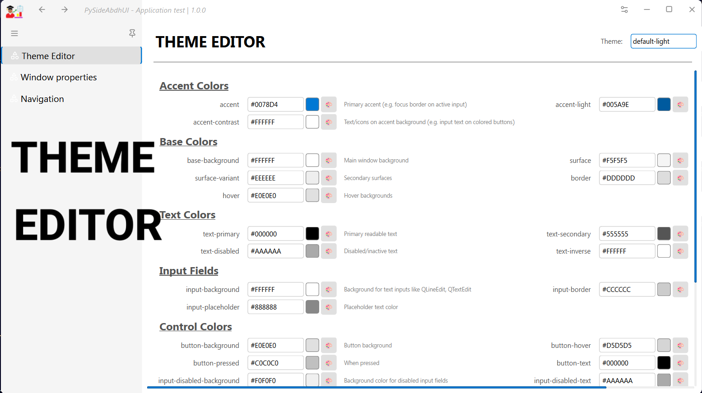

# PySideAbdhUI 
v1.0.1

**PySideAbdhUI** is a clean, reusable, and highly customizable UI component package built with [PySide6](https://doc.qt.io/qtforpython/). It is ideal for building professional and elegant desktop applications, especially those needing consistent styles, structured windows, enhanced widgets, and notification systems.

---

## 🔧 Features

- 📦 **Modular Widgets**: Custom widgets like `StackedWidget`, `Notify`, `StyledTableWidget`, and more.
- 🎨 **Theming Support**: Includes bundled QSS (Qt Style Sheet) themes that are easy to apply.
- 🧠 **Utilities Included**: Helpful UI utilities such as style loaders, path resolution, and notifications.
- 📁 **Bundled Resources**: Icons (`.svg`) and styles (`.qss`) included and auto-detected even when bundled via PyInstaller.
- 🛠️ **Ready for Production**: Easily embeddable in other applications, and compatible with PyInstaller and custom build scripts.

---
<p>Sample Preview</p>
<p align="center">
  
  <br>
  
  
</p>

## 📦 Installation

You can install this package **locally** using pip:

```bash
pip install x:\path\to\PySideAbdhUI
```
or
```bash
pip install git+https://github.com/abdhmohammadi/PySideAbdhUI.git
```
Alternatively, install in editable mode (recommended for development):

```bash
pip install -e F:\Projects\Python\PySideAbdhUI
```

> ✅ This method allows the package to be used across **any Python IDE**, without needing to build a wheel (`.whl`) file.

---

## 🧪 Test Your Installation

To test whether the package is correctly installed run a bundled test file (if provided):

```bash
python test.py
```

---

## 🗂️ Package Structure

Your package is structured like this:

```
PySideAbdhUI/
├── PySideAbdhUI/
│   ├── __init__.py              # Core module entry
│   ├── Widgets.py               # Custom UI widgets
│   ├── Window.py                # Custom main window manager
│   ├── StyleManagers.py         # QSS stylesheet loader
│   ├── TableWidget.py           # Extended QTableWidget
│   ├── Notify.py                # Notification system
│   ├── utils.py                 # Utility functions
│   └── resources/
│       ├── icons/
│       │   └── svg/             # Icon SVGs
│       └── styles/              # .qss stylesheets
├── test-images/                 # Screenshots for documentation
│   ├── 01.png
│   ├── 02.png
│   ├── 03.png
│   └── 04.png
├── LICENSE                      # MIT License
├── README.md                    # This file
├── setup.py                     # Install configuration
└── MANIFEST.in                  # Resource inclusion rules
```
---

## 🚀 Example Usage

Here’s a quick Python example showing how to use PySideAbdhUI components in your app:

```python
from PySideAbdhUI import PopupNotifier, utils
from PySide6.QtWidgets import QApplication, Window

app = QApplication([])

# Load and apply custom style
theme = utils.ThemeManager()

theme.apply_theme(QApplication.instance(),theme.get_current_theme_name())
window = Window.AbdhWindow()
window.initUI(app_title= 'AbdhUI Application', title_logo_path= state.application_path + "/resources/icons/png/app-icon.png")    
window.show()
PopupNotifier.Notify(window,"Wellcome!", "📚 AbdhUI is in your service.", 'bottom-right')
    
app.exec()
```
---

## ✅ Requirements

- Python ≥ 3.13
- PySide6

Install PySide6 if not available:

```bash
pip install PySide6
```

---

## 📄 License

This project is licensed under the MIT License. See the [LICENSE](LICENSE) file for full terms.

---

## 🤝 Contributing

Pull requests, issues, and feature suggestions are always welcome. You can:

- Fork the project
- Submit a PR
- Report bugs or request features

> Developed with ❤️ by `Abdh`
> 
---

## 📢 Tips for Distribution

To use this package in PyInstaller or freeze it with your own application:

- Use `collect_submodules("PySideAbdhUI")` and `collect_data_files("PySideAbdhUI")` in your `.spec` file
- The `get_resource_path()` function ensures the package detects bundled resources correctly

---
## 🗨️ Join the Discussion

Have questions, feedback, or suggestions? Join the conversation on our GitHub Discussions!

[](https://github.com/abdhmohammadi/PySideAbdhUI/discussions)


Enjoy building with **PySideAbdhUI**!
